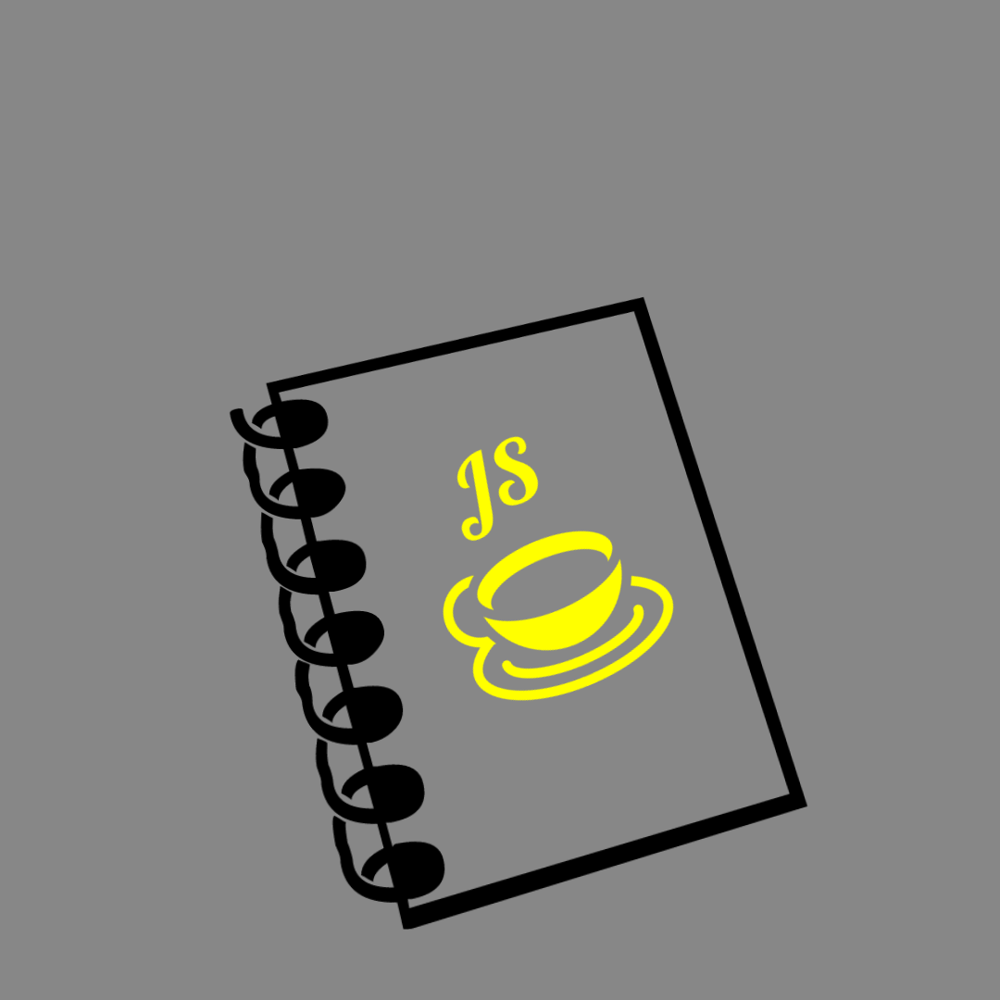

# potential security vulnerabilities in dependencies for nodeschool please use with caution

# coffee-journals

coffee journals is a collection of plain javascript theory, algorithm and functions known as cj scripts.
this is a collection for education and to help others understand javascript better

below is a qoute and a link to a thread talkin about vanilla JS from a framework.

quoted from [stackoverflow](http://stackoverflow.com/questions/20435653/what-is-vanillajs) in which I got a idea for.

"VanillaJS is a name to refer to using plain JavaScript without any additional libraries like jQuery. People use it as a joke to remind other developers that many things can be done nowadays without the need for additional JavaScript libraries."

- [vanilla-js](http://vanilla-js.com)

### coffee-journals list
- [algorithm](https://github.com/ezwebcraft/coffee-journals/tree/master/algorithm)
- [nodeschool](https://github.com/ezwebcraft/coffee-journals/tree/master/nodeschool)
- [basic react](https://github.com/ezwebcraft/coffee-journals/tree/master/basic_react)
