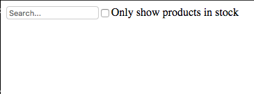

### excerise 1

we have five components in our simple app. We’ve italicized the data each component represents.

- FilterableProductTable (orange): contains the entirety of the example
- SearchBar (blue): receives all user input
- ProductTable (green): displays and filters the data collection based on user input
- ProductCategoryRow (turquoise): displays a heading for each category
- ProductRow (red): displays a row for each product

### Main parts

- Static version - step 1
- Step 2 : Build static version in React

